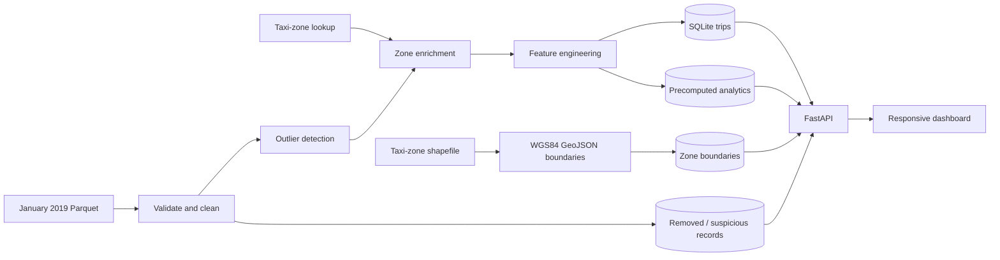

# Urban Mobility Data Explorer

An end-to-end data engineering and analytics application for exploring New York City yellow taxi activity. The project ingests the January 2019 NYC TLC trip dataset, validates and cleans millions of records, enriches trips with taxi-zone geography, computes analytical features, and serves a responsive dashboard through a FastAPI and SQLite backend.

The application includes dataset-level KPIs, pickup-date and pickup-borough filters, revenue analysis, pickup and drop-off mobility patterns, suspicious-record inspection, downloadable reports, and a complete NYC taxi-zone revenue choropleth.

## Documentation and walkthrough

- [Project documentation](docs/Documentation.pdf)
- [BSE Team 8 task sheet](<docs/BSE_Team_Task _Sheet_[EWD_Summative _Urban_Mobility_Data_Explorer_Cohort 3_Team8] - 1.pdf>)
- [Video walkthrough](https://youtu.be/Joa_MklNCNw)

## Important: data files are not bundled

The populated database and source Parquet file are intentionally not stored in the repository:

- A fully populated `data/mobility.db` is larger than 2 GB, exceeding GitHub's file-size limits. A local database build is therefore required through the ETL loader in `etl/load/load_all.py`.
- `yellow_tripdata_2019-01.parquet` is also excluded because it is a large binary source file. The official NYC TLC download is provided below.

Download:

[`yellow_tripdata_2019-01.parquet`](https://d37ci6vzurychx.cloudfront.net/trip-data/yellow_tripdata_2019-01.parquet)

Expected destination:

```text
etl/data/raw/yellow_tripdata_2019-01.parquet
```

The repository already contains the taxi-zone lookup and spatial shapefile components required by the loader. The shapefile's `.shp`, `.dbf`, `.shx`, `.prj`, and related components must remain together with their existing names.

## What the project does

The system turns a large raw transportation dataset into a browser-based analytical product:

1. Reads the Parquet source incrementally instead of loading the entire dataset into memory.
2. Validates column presence and coerces dates, identifiers, amounts, and text into predictable types.
3. Removes records that cannot safely enter the analytical dataset, while preserving them in `suspicious_records` with a reason.
4. Flags extreme but structurally valid trips as outliers without removing them from `trips`.
5. Joins pickup and drop-off taxi-zone names, boroughs, and service-zone metadata.
6. Derives duration, speed, fare-per-mile, pickup hour, weekday, and tip percentage.
7. Writes cleaned trips to SQLite in 100,000-row chunks.
8. Builds compact aggregate tables used by the dashboard, avoiding repeated scans over millions of trips.
9. Defers expensive indexes until bulk loading finishes, then rebuilds them and refreshes SQLite planner statistics.
10. Serves analytics and map data through a read-only FastAPI API.



## Dashboard areas

- **Dashboard** — summary KPIs, top pickup zones, fare distribution, pickup-borough filtering, and pickup-date filtering.
- **Revenue Analytics** — daily trends, borough revenue, payment-method comparisons, and fare ranges.
- **Mobility Analytics** — top pickup and drop-off zones, borough activity, and average trip distance by hour.
- **Zone Intelligence** — a complete NYC taxi-zone map colored by pickup revenue, with zone-level hover details and revenue rankings.
- **Data Quality** — invalid records removed during cleaning and outlier information retained on valid trips.
- **Reports** — generated summaries for revenue, zones, mobility, and quality analysis.

## Technology stack

| Layer | Technology |
|---|---|
| Data processing | Python, pandas, PyArrow |
| Spatial processing | GeoPandas, Shapely-compatible geometry stack |
| Database | SQLite |
| API | FastAPI, Uvicorn |
| Frontend | HTML, CSS, vanilla JavaScript |
| Charts and maps | Chart.js, Leaflet, CARTO/OpenStreetMap tiles |


## Prerequisites

The local environment requires:

- Git
- Python 3.11 or newer
- At least 5 GB of free disk space for the Parquet input, populated database, temporary SQLite WAL files, and indexes
- A stable internet connection for downloading the source dataset and loading CDN-hosted frontend libraries/map tiles

The ETL is CPU-, disk-, and memory-intensive. Runtime depends heavily on the machine and storage device. An SSD is strongly recommended.

## Quick start

The commands below assume the repository root as the working directory unless a step explicitly changes directories.

### 1. Clone the repository

```bash
git clone <repository-url>
cd Urban-Mobility-Data-Explorer_T8
```

`<repository-url>` represents this repository's Git URL.

### 2. Create and activate a virtual environment

Windows PowerShell:

```powershell
python -m venv venv
.\venv\Scripts\Activate.ps1
```

For terminals where PowerShell blocks local activation scripts, the following process-scoped policy enables activation for the current session:

```powershell
Set-ExecutionPolicy -Scope Process -ExecutionPolicy Bypass
```

macOS or Linux:

```bash
python3 -m venv venv
source venv/bin/activate
```

### 3. Install dependencies

```bash
python -m pip install --upgrade pip
python -m pip install -r requirements.txt
```

### 4. Download the trip dataset

The following commands create the raw-data directory when absent and download the source file.

Windows PowerShell:

```powershell
New-Item -ItemType Directory -Force etl/data/raw | Out-Null
Invoke-WebRequest `
  -Uri "https://d37ci6vzurychx.cloudfront.net/trip-data/yellow_tripdata_2019-01.parquet" `
  -OutFile "etl/data/raw/yellow_tripdata_2019-01.parquet"
```

macOS or Linux:

```bash
mkdir -p etl/data/raw
curl -L \
  "https://d37ci6vzurychx.cloudfront.net/trip-data/yellow_tripdata_2019-01.parquet" \
  -o etl/data/raw/yellow_tripdata_2019-01.parquet
```

Expected raw-data layout:

```text
etl/data/raw/
├── yellow_tripdata_2019-01.parquet
├── taxi_zone_lookup.csv
└── spatial_metadata/
    ├── taxi_zones.shp
    ├── taxi_zones.dbf
    ├── taxi_zones.shx
    ├── taxi_zones.prj
    └── ...
```

### 5. Build the local database

The full load should run while the backend server and external database viewers are stopped:

```bash
python -m etl.load.load_all
```

This command:

- creates or updates the schema;
- loads taxi-zone lookup records;
- converts spatial boundaries to WGS84 GeoJSON;
- clears and reloads trip and suspicious-record tables;
- processes the Parquet source in chunks;
- writes analytics aggregates;
- rebuilds deferred indexes; and
- runs `ANALYZE` for SQLite query planning.

The generated database is written to:

```text
data/mobility.db
```

The loader commits trip batches periodically. An interruption during trip processing may therefore leave a partially populated database and requires another full load. When all trips are present and only the final analytics or index stage fails, the analytics-only recovery procedure can complete the build.

### 6. Start the API

From the repository root:

```bash
python -m uvicorn backend.app:app --reload --host 127.0.0.1 --port 8000
```

Useful backend URLs:

- API root: <http://127.0.0.1:8000/>
- Interactive Swagger documentation: <http://127.0.0.1:8000/docs>
- OpenAPI specification: <http://127.0.0.1:8000/openapi.json>

The frontend requests `http://localhost:8000/api` by default. Deployments using another backend host or port require a corresponding `API_BASE_URL` change in `frontend/js/api.js`.

### 7. Serve the frontend

The frontend runs from a separate terminal while the backend remains available:

```bash
cd frontend
python -m http.server 5500
```

Application URLs:

- Landing page: <http://localhost:5500/>
- Dashboard directly: <http://localhost:5500/pages/dashboard.html>

Direct `file://` access is unsupported because the client-side router fetches page fragments over HTTP.

## ETL behavior in detail

### Validation

The validator checks the expected schema and normalizes:

- pickup and drop-off timestamps;
- vendor, rate, location, passenger, and payment identifiers;
- distance, fare, tax, tip, toll, surcharge, and total columns; and
- store-and-forward text values.

Missing columns are reported before downstream transformations rely on them.

### Cleaning and removed records

Rows are removed from the main trip dataset when they contain:

- missing required values;
- invalid timestamp ordering;
- pickup or drop-off timestamps outside January 2019;
- negative trip distance;
- negative fare or total amount; or
- exact duplicate trip data within a processed chunk.

Removed rows are written to `suspicious_records` with a `removal_reason`. This preserves an audit trail while keeping invalid values away from constrained analytical tables.

### Outlier detection

Structurally valid trips remain in `trips` but receive `is_outlier = 1` and one or more `outlier_reasons` when they exceed configured thresholds, including:

- distance greater than 100 miles;
- total amount greater than $500;
- fare amount greater than $500;
- average speed greater than 120 mph; or
- duration greater than 8 hours.

This distinction is important: **cleaning removes invalid records; outlier detection flags unusual records without deleting them**.

### Zone enrichment

Pickup and drop-off location identifiers are enriched with:

- borough;
- taxi-zone name; and
- service zone.

Literal labels such as `"N/A"` are preserved instead of being interpreted as missing pandas values. Final analytics labels are reconciled against the authoritative `locations` dimension.

### Feature engineering

The pipeline adds:

- `trip_duration_minutes`;
- `average_speed_mph`;
- `fare_per_mile`;
- `pickup_hour`;
- `pickup_day_of_week`; and
- `tip_percentage`.

Undefined ratios, such as fare-per-mile for a zero-distance trip, are stored as null rather than infinity.

### Performance design

The application is designed so interactive pages do not repeatedly aggregate the multi-gigabyte `trips` table:

- Parquet input is streamed in 100,000-row chunks.
- SQLite inserts use explicit column lists and Python-native scalar conversion.
- WAL mode and batched commits reduce write overhead.
- Trip indexes are deferred until after bulk insertion.
- Analytics are accumulated incrementally during the load.
- Dashboard filter cubes are precomputed by pickup date and pickup borough.
- API requests use compact analytics tables and read-only SQLite connections.
- GZip middleware compresses larger API responses, including zone geometry.

## Analytics-only recovery

For a complete `trips` table with missing analytics tables or deferred indexes, the recovery command avoids another Parquet load:

```bash
python -m etl.load.load_all --analytics-only
```

This performs one streamed scan of the existing `trips` table, rebuilds all analytics aggregates, reconciles zone labels, recreates query indexes, and refreshes planner statistics.

This command requires a complete trips dataset in `data/mobility.db`; it cannot reconstruct an empty or partial `trips` table.

## Database design

The schema is defined in `database/schema.sql`; deferred indexes are defined in `database/indexes.sql`.

### Core tables

| Table | Purpose |
|---|---|
| `locations` | Taxi-zone lookup dimension |
| `zone_boundaries` | WGS84 zone geometry stored as GeoJSON text |
| `trips` | Cleaned, enriched, feature-engineered trips |
| `suspicious_records` | Rows removed during cleaning, with reasons |

### Aggregate tables

| Table | Purpose |
|---|---|
| `analytics_summary` | Dataset-wide KPIs and quality counts |
| `analytics_pickup_zones` | Pickup activity by zone |
| `analytics_zone_revenue` | Pickup trip count and revenue for the map |
| `analytics_dropoff_zones` | Drop-off activity by zone |
| `analytics_fare_distribution` | Fare buckets and revenue |
| `analytics_borough_revenue` | Trips and revenue by borough |
| `analytics_daily_revenue` | Daily trip and revenue trend |
| `analytics_average_fare` | Fare, tip, and total averages by payment method |
| `analytics_hourly_distance` | Distance and duration by pickup hour |
| `analytics_dashboard_slices` | Filterable dashboard summary cube |
| `analytics_dashboard_pickup_zones` | Filterable pickup-zone cube |
| `analytics_dashboard_fare_distribution` | Filterable fare-distribution cube |

## API reference

All application endpoints use the `/api` prefix.

| Method | Endpoint | Description |
|---|---|---|
| `GET` | `/api/trips` | Paginated trips; accepts `limit` and `offset` |
| `GET` | `/api/trips/{trip_id}` | One trip by ID |
| `GET` | `/api/zones` | All mapped zones, boundaries, and pickup revenue |
| `GET` | `/api/zones/{zone_id}` | One zone and its optional boundary |
| `GET` | `/api/suspicious-records` | Paginated removed records |
| `GET` | `/api/analytics/dashboard-filter-options` | Available pickup boroughs and dates |
| `GET` | `/api/analytics/summary` | Global or filtered summary KPIs |
| `GET` | `/api/analytics/top-pickup-zones` | Ranked pickup zones |
| `GET` | `/api/analytics/top-dropoff-zones` | Ranked drop-off zones |
| `GET` | `/api/analytics/fare-distribution` | Fare ranges and revenue |
| `GET` | `/api/analytics/revenue-by-borough` | Borough revenue totals |
| `GET` | `/api/analytics/revenue-trends` | Daily revenue series |
| `GET` | `/api/analytics/average-fare` | Fare metrics by borough/payment method |
| `GET` | `/api/analytics/average-distance` | Hourly distance and duration metrics |

The dashboard summary, pickup-zone, and fare-distribution endpoints accept optional filters where applicable:

```text
borough=Manhattan
pickup_date=2019-01-15
```

Example:

```text
http://localhost:8000/api/analytics/summary?borough=Manhattan&pickup_date=2019-01-15
```

`pickup_date` uses the ISO `YYYY-MM-DD` format.

## Project structure

```text
Urban-Mobility-Data-Explorer_T8/
|-- .vscode/
|   `-- settings.json
|-- backend/
|   |-- algorithms/         # Merge sort and top-zone selection
|   |-- config/             # SQLite paths and connection settings
|   |-- models/             # Trip, location, boundary, and quality models
|   |-- routes/             # FastAPI route handlers
|   |-- services/           # Trip, zone, and analytics services
|   |-- utils/              # Backend helpers and validators
|   `-- app.py              # FastAPI application entry point
|-- data/
|   `-- mobility.db         # Local SQLite database; populated size exceeds 2 GB
|-- database/
|   |-- indexes.sql         # Deferred and query-performance indexes
|   |-- schema.sql          # Tables, relationships, and constraints
|   `-- seed_data.sql       # Optional seed definitions
|-- docs/
|   |-- Documentation.pdf
|   `-- BSE_Team_Task _Sheet_[EWD_Summative _Urban_Mobility_Data_Explorer_Cohort 3_Team8] - 1.pdf
|-- etl/
|   |-- data/
|   |   |-- logs/
|   |   |   `-- cleaning_summary.json
|   |   `-- raw/
|   |       |-- spatial_metadata/    # NYC taxi-zone shapefile components
|   |       |-- taxi_zone_lookup.csv
|   |       `-- yellow_tripdata_2019-01.parquet  # Downloaded locally
|   |-- extract/             # Parquet, lookup, GeoJSON, and spatial loaders
|   |-- load/                # Database, trip, boundary, and analytics loaders
|   |-- transform/           # Validation, cleaning, outliers, joins, and features
|   |-- utils/               # ETL configuration and audit logging
|   `-- main.py              # ETL entry point
|-- frontend/
|   |-- assets/images/       # Application logo
|   |-- components/          # Shared sidebar, navbar, and cards
|   |-- css/                 # Base, dashboard, revenue, and responsive styles
|   |-- js/                  # API client, router, charts, and page controllers
|   |-- pages/               # Dashboard, revenue, mobility, zones, quality, reports
|   `-- index.html           # Landing page
|-- .gitignore
|-- README.md
`-- requirements.txt
```

## Troubleshooting

### `FileNotFoundError` for the Parquet file

Required filename and path:

```text
etl/data/raw/yellow_tripdata_2019-01.parquet
```

Repeated browser downloads may append `(1)` or another suffix. Such suffixes must be removed before loading.

### The dashboard loads but displays API errors

Required runtime state:

1. the database loader completed successfully;
2. `data/mobility.db` exists and is populated;
3. Uvicorn is running on port `8000`;
4. the frontend is served over HTTP rather than opened as a local file; and
5. <http://localhost:8000/docs> opens successfully.

### `database is locked`

The full ETL requires the API and external database viewers to be stopped. SQLite permits multiple readers but only one writer. The backend can restart after loading finishes.

### Analytics are empty after a late ETL failure

For a complete trips table, run:

```bash
python -m etl.load.load_all --analytics-only
```

An incomplete trips table requires the full loader instead.

### Zone map is blank

The map requires:

- successfully loaded `locations`, `zone_boundaries`, and `analytics_zone_revenue` tables;
- internet access for Leaflet/CARTO tiles and CDN assets; and
- a running API at `localhost:8000`.

Additional diagnostics are available in the browser developer console and through the `/api/zones` Swagger request.


## Data source and scope

Trip records come from the [NYC Taxi & Limousine Commission Trip Record Data](https://www.nyc.gov/site/tlc/about/tlc-trip-record-data.page). This project is currently configured specifically for the January 2019 yellow taxi Parquet schema and date range.

The source data may contain quality issues, corrections, unusual values, or fields whose interpretation is governed by NYC TLC documentation. Analytical results should be understood in that context.

## Development notes

- Python modules use the repository root for consistent package imports and configured paths.
- Uvicorn requires a restart after database replacement because API connections use immutable read-only mode for fast serving.
- Schema changes must remain synchronized with loader insert columns and API queries.
- ETL type conversions and database-writing edge cases should include corresponding test coverage.
- Virtual environments, Python bytecode, SQLite WAL/SHM files, downloaded Parquet files, and populated multi-gigabyte databases are local artifacts rather than repository content.
